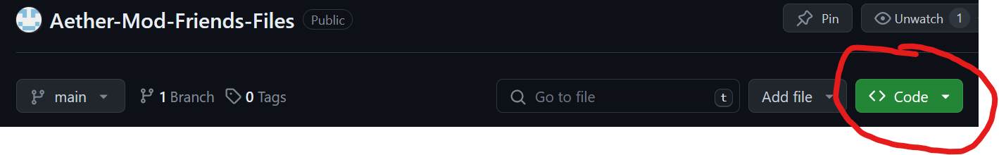
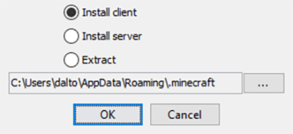

# Aether-Mod-Friends-Files
 A repo to help with finding all the files necessary to access my hosted minecraft server

# Installation Instructions

### Step 1

Download this repo

### Step 2
Double click the `forge-1.20.1-47.2.0-installer.jar` file after download and install the `client`

