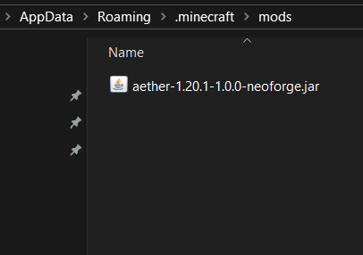

# Aether-Mod-Friends-Files
 A repo to help with finding all the files necessary to access my hosted minecraft server

## 1 Installation Instructions

### 1.1

Download this repo

### 1.2
Double click the `forge-1.20.1-47.2.0-installer.jar` file after download and install the `client`

## 2 Adding Mods

### 2.1
From the Minecraft launcher, enter the Installations tab at the top.

### 2.2
Hover over your Forge installation, then press the Open Folder icon to the right.

### 2.3
In the new window, locate or create the mods folder, then enter it

### 2.4 
Paste the `aether-1.20.1-1.0.0-neoforge.jar` file into this location

